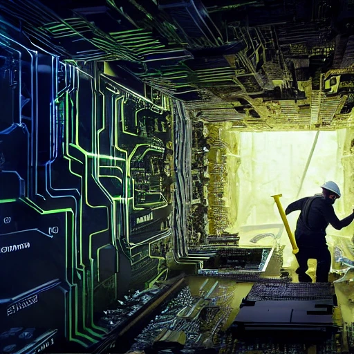
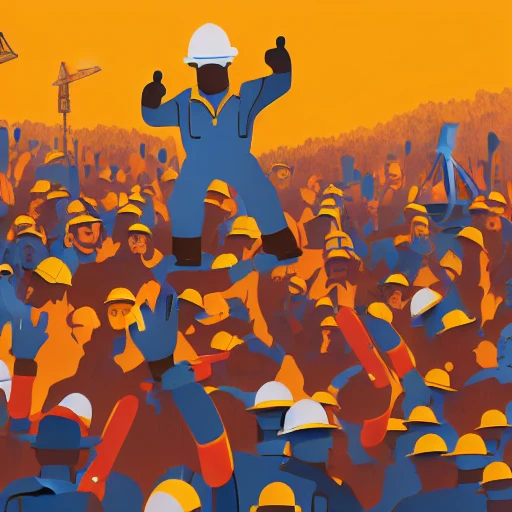
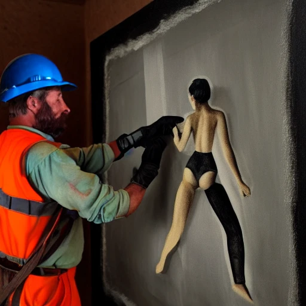
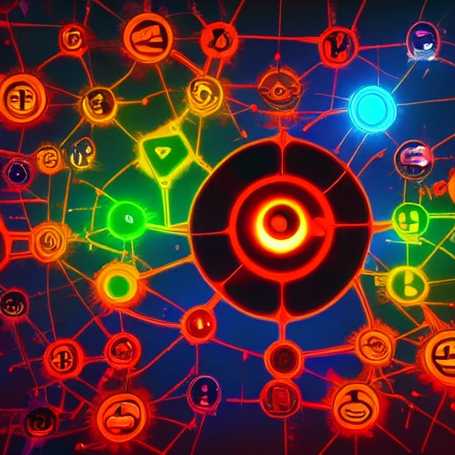

# Frequently Asked Questions

## How does this all work?

This is a very big subject which will be later be expanded in a devlog. But putting it simply:

* As a requestor, you send a prompt to the horde which adds it into a "first in/first out" queue, prioritizing it according to the amount of Kudos you have. If the request has multiple generations required, it is split into multiple jobs by the horde.
* Any joined workers periodically check-in to the horde and request a job to do. The horde sends them the first available request they can fulfil, by order of kudos-priority
* The worker generates the job's prompt and submits it back to the horde
* Once all the component jobs of a request have been submitted, the horde marks the job as "Done"
* The requestor can at any point check the status of their job and retrieve the results, even if it's not "done"

## Workers?

### What is a worker?

A worker is computer with usually a mid-range or higher class GPU, who has setup specific software to generate images via Stable Diffusion or KoboldAI localy and it connected to the horde through what we call the "bridge". It is constantly polling the horde for new generations and receiving Kudos in return for creating them.

### What is in it for the worker?

Generating images for others 24/7 technically costs electricity, we know.

People want to contribute to the horde for many reasons

* They want to provide constant processing power for tools they've built on top of Stable Diffusion or KoboldAI, such as video games, chat bots or software plugins
* They want to accumulate Kudos so that when it's time to generate their own requests they can get them done faster.
* They want to warm their room productively (this is indeed a literal reason people have given)
* They are just nice people and want to support this endeavour.

### Can workers spy on my prompts or generations?

Technically, yes. While the worker software and the bridge code is not set to allow it, ultimately the software resides at someone else's computer and is open source. As such, anyone with the know-how can modify their own code to not just see all prompts passing through, but even save all results they generate. 

However workers do not have any identifying information about individual requestors as they cannot see their ID or IP.

Nevertheless always request generations as if you're posting in a public forum like using a discord bot. While the horde is technically more private than that, it's a good practice anyway.

### Can I turn off my worker whenever I want?

Yes! We do not require workers to stay always online. We only request that you put your worker in maintenance before you do so to avoid messing with a currently running generation your worker might have picked up.

### Do workers support multiple models

Depends. 

For text generation on the KoboldAI Horde the answer is yes, but you select your model manually.

For image generation on the Stable Horde, the answer is not yet. We plan to add this functionality in the future.

## Kudos?

### What, what is Kudos?

Another big subject. This one actually [has a devlog about it](https://dbzer0.com/blog/the-kudos-based-economy-for-the-koboldai-horde/)

### How do I get Kudos?

Connect a worker to the horde, that is all! You will generate kudos for each request you fulfil, relevant to its difficulty, and you will also generate kudos every 10 minutes your worker stays online.

### I don't have a powerful GPU. How can I get Kudos?

We use Kudos to support good behaviour in the community. As such we have ways to receive Kudos outside of generating images for others (although that's the best way)

* Fulfill a bounty from our discord bounties forum
* Subscribe to [the patreon supporting the development of the AI Horde](https://www.patreon.com/db0).
* Request some people to transfer some to you.

And more are planned!

### Can I transfer my Kudos?

Yes. See the `/transfer` endpoint on each horde.

Remember however that the Kudos is merely a prioritization mechanism, **not a currency**. The Hordes are under no obligation to maintain Kudos totals and we may change them to ensure better operation of the horde. **If you exchange anything for Kudos, you do so at your own risk** and we are in no obligation to protect your amount! Kudos has no inherent value.

## Not Safe for Work?

### Can I request NSFW images/text?

Yes, but you might have a smaller a pool of workers to fulfil your request, which will lead to longer generation times.

### Do you censor generations?

The horde itself cannot, but each individual worker might have its own censorship guidelines. And each requestor can voluntarily opt-in to accidental NSFW censorship.

## Why are some of my images just black?

Those generations have been NSFW-censored by the worker generating them. If you've specified your request as SFW, individual SFW workers who fulfil it might have the NSFW censorship model active, which will return just this black image. To avoid such images, turn on NSFW, or ensure your prompt is not too close to the edge of SFW/NSFW.

## Why are some of my images are still censored even though I'm requesting NSFW?

Each individual worker can optionally define a censorlist. If any word inside that list is found, the worker will automatically post-process using a NSFW censorship model. These words are things that should never be combined with NSFW content or would run into legal troubles for the worker if they did.

This means your censored images triggered one such worker's censorlist. You can rerun the prompt and hope you get a generation with a seed that doesn't trigger the NSFW model, or hope to get a new worker, or tweak your prompt.

If you feel a worker is using the censorlist maliciously, or improperly, please contact us with the content of your prompt and the worker name, and we'll address it.

### Where can I read more of NSFW controls?

* [The NSFW Question](https://www.patreon.com/posts/nsfw-question-72771484)
* [Blacklists](https://www.patreon.com/posts/72890784)

## Horde?

### Why "AI Horde"?

This project started as a way to consolidate resources for the KoboldAI Client. As we needed a name for it, I came up with something thematic for the concept of "Kobolds". "A Horde of Kobolds". When I started doing image generation as well, I kept the "Horde" part.

The AI Horde is the underlying technology. We separate each type of code according to the type of generations they provide

There are two hordes at the moment
   * [Stable Horde](https://stablehorde.net): Stable Diffusion Image Generation
   * [KoboldAI Horde](https://koboldai.net): KoboldAI text generation

But more Hordes for other purposes are possible.

### Does the horde spy on my prompts and generations?

No, the horde itself is not storing such details. The prompts and the generations are only stored in-memory transiently and deleted shortly after the generation is delivered or cancelled.

### Why should I use the Horde and not my local PC?

Not everyone has a power GPU in their PC. The horde allows anyone to use fast Stable Diffusion and KoboldAI, not only the ones privileded enough to be able to afford an expensive graphics card. 

Furthermore, local clients, even at the best of times, are difficult to setup up and often error prone due to python dependencies. They also need plenty of internet bandwidth to download 4GB of models. The stable horde provides no-install clients, as well as browser clients you can use even on your phone!

Finally if you wanted to provide a service built on image or text generation, you can now use your own PC to power your image generations, and therefore avoid all the complexity and capital costs required with setting up a server infrastructure. 

### Why should I use the Horde and not a service like Stability.ai?

Because the Horde is free! You will never need to pay to use the horde. Sure if the demand is high, your delivery speed might not be great, but that is true with other services like midjourney

Second, the Horde gives you all the benefits of a local installation, such as freedom in prompts, while still allowing a browser interface. and flexibility.

Finally unlike many of these services, Horde also provides a fully fledged REST API you can use to integrate your applications, without worrying about costs.

### Why should I use the Horde and not a free service?

Because when the service is free, you're the product!

Other services which run on centralized servers have costs. Someone has to pay for the electricity, and the server infrastructure. The horde is explicit of how these costs are crowdsourced and there's no need for us to ever add anything in the future to change our existing model. Other free services tend to be deliberately obscure in how they use your prompts, results, and data, or explicitly say that your data is going to be the product. Such services eventually pivot their usercount to make money through advertisements and data brokering.

If you're fine with that, go ahead and use them.

Finally a lot of these services do not provide free REST APIs, so if you need to integrate with them, you have to use a browser interface, so that you can see the adverts.